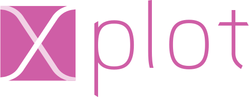

.. Copyright (c) 2016, Johan Mabille, Sylvain Corlay and Wolf Vollprecht

   Distributed under the terms of the BSD 3-Clause License.

   The full license is in the file LICENSE, distributed with this software.

.. raw:: html
    :file: embed_widgets/xleaflet_example.html

.. raw:: html
    :file: embed_widgets/xplot_example.html

Related projects
================

xplot_ if the C++ backend for the bqplot_ 2-D plotting library

**C++ code**

.. code::

    #include <algorithm>
    #include <random>
    #include <vector>

    #include "xplot/xfigure.hpp"
    #include "xplot/xmarks.hpp"
    #include "xplot/xaxes.hpp"

    auto randn(std::size_t n)
    {
        std::vector<double> output(n);
        std::random_device rd;
        std::mt19937 gen(rd());
        std::normal_distribution<> dis(5, 2);

        std::for_each(output.begin(), output.end(), [&dis, &gen](auto& v){v = dis(gen);});

        return output;
    }

    std::size_t data_size = 200;
    std::vector<double> data_x(data_size);
    std::iota(data_x.begin(), data_x.end(), 0);
    std::vector<double> data_y = randn(data_size);
    std::vector<double> data_c = randn(data_size);

    xpl::linear_scale scale_x, scale_y;
    xpl::linear_scale scale_size;

    auto scatter = xpl::scatter_generator(scale_x, scale_y, scale_size)
        .x(data_x)
        .y(data_y)
        .size(data_c)
        .stroke("black")
        .default_size(128)
        .enable_move(true)
        .colors(std::vector<xtl::xoptional<std::string>>{"orangered"})
        .finalize();

    xpl::axis axis_x(scale_x), axis_y(scale_y);
    axis_x.label = "x";
    axis_y.label = "y";
    axis_y.orientation = "vertical";
    axis_y.side = "left";

    xpl::figure fig;
    fig.padding_x = 0.025;
    fig.add_mark(scatter);
    fig.add_axis(axis_x);
    fig.add_axis(axis_y);
    fig

**Output**

.. raw:: html

    

xleaflet_ is the C++ backend for the leaflet maps visualization library. The Python reference implementation is available in the ipyleaflet_ project

**C++ code**

.. code::

    #include "xwidgets/xhtml.hpp"

    #include "xleaflet/xmap.hpp"
    #include "xleaflet/xmarker.hpp"

    auto html = xw::html_generator()
        .value("Hello from an <b>xwidget</b> in an <b>xmarker</b>!")
        .finalize();

    std::array<double, 2> center = {52.204793, 360.121558};

    auto map = xlf::map_generator()
        .center(center)
        .zoom(15)
        .finalize();

    auto marker = xlf::marker_generator()
        .location(center)
        .draggable(false)
        .popup(html)
        .finalize();
    map.add_layer(marker);

    map

**Output**

.. raw:: html

    

xproperty_ is the C++ implementation of the observer pattern underlying
``xwidgets``. It is to ``xwidgets`` what the traitlets project is to
``ipywidgets``.

.. _xplot: https://github.com/QuantStack/xplot.git
.. _bqplot: https://github.com/bloomberg/bqplot.git
.. _xleaflet: https://github.com/QuantStack/xleaflet.git
.. _ipyleaflet: https://github.com/jupyter-widgets/ipyleaflet.git
.. _xproperty: https://github.com/QuantStack/xproperty.git
